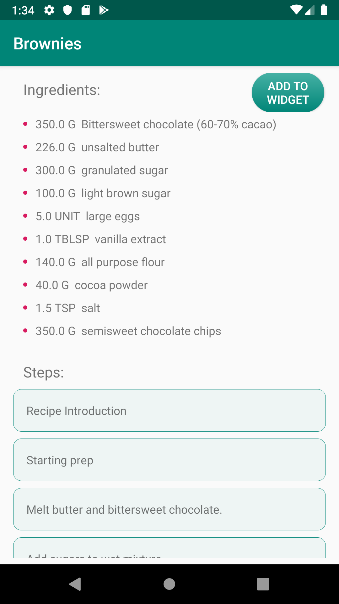

# Baking App 

## Project Overview

**Baking App** allows Udacity’s resident baker-in-chief, Miriam, to share her recipes with the world. The user can select a recipe and see video-guided steps for how to complete it.

The project is part of the Udacity course: **Android Developer Nanodegree Program**.

## Why this Project

The app is not only functional, but is also in a production-ready state. It uses Exoplayer to display videos, handles error cases in Android, has its own widget, uses fragments to create a responsive design that works on phones and tablets.

## Project requirements

- App should display recipes from provided network resource. 
- App should allow navigation between individual recipes and recipe steps.
- App uses RecyclerView and can handle recipe steps that include videos or images.
- Application uses Master Detail Flow to display recipe steps and navigation between them.
- Application uses Exoplayer to display videos.
- Application properly initializes and releases video assets when appropriate.
- Application should properly retrieve media assets from the provided network links. It should properly handle network requests.
- Application makes use of Espresso to test aspects of the UI.
- Application has a companion homescreen widget.
- Widget displays ingredient list for desired recipe.

## Screenshots

 &nbsp;&nbsp; 

